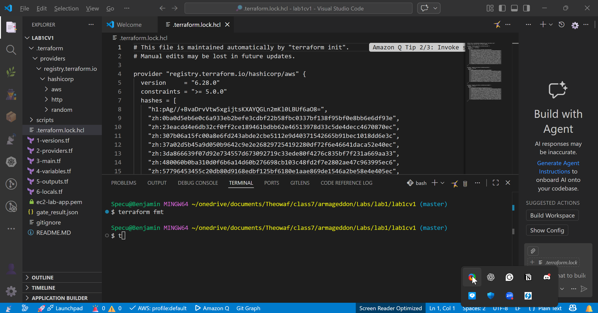
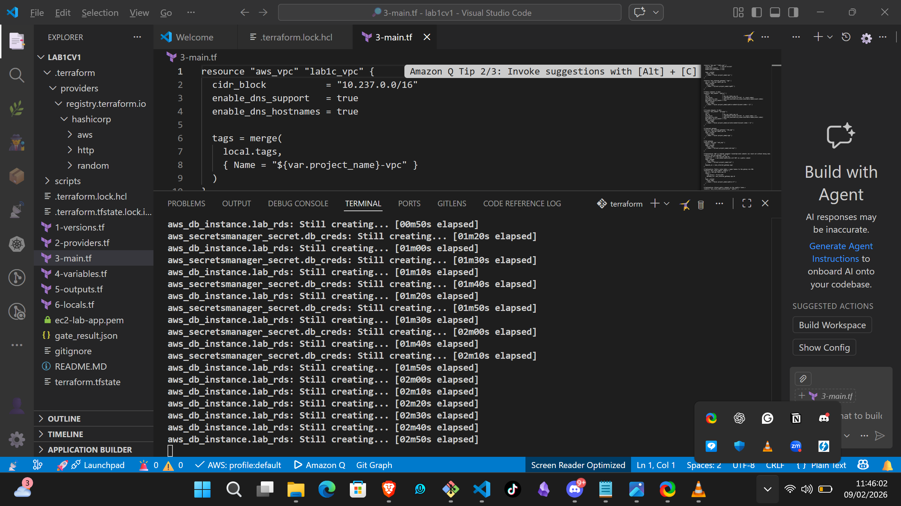
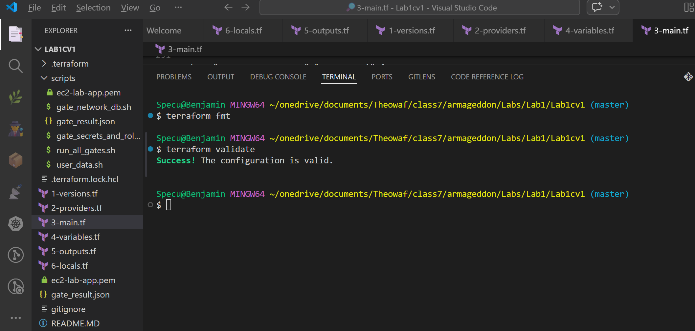
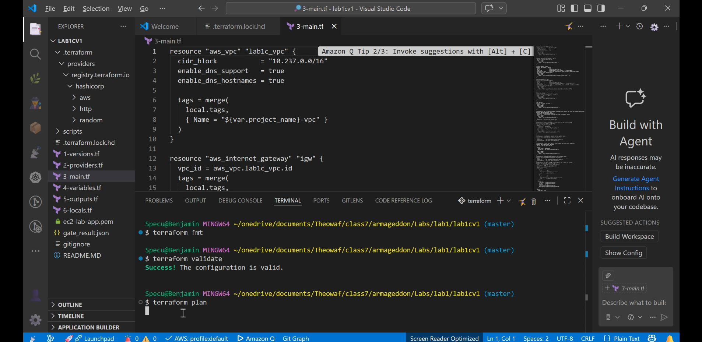
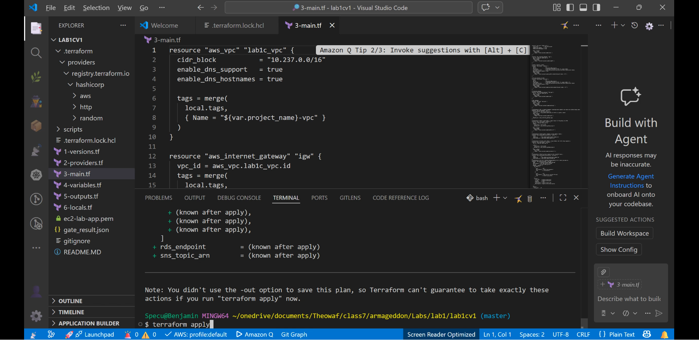
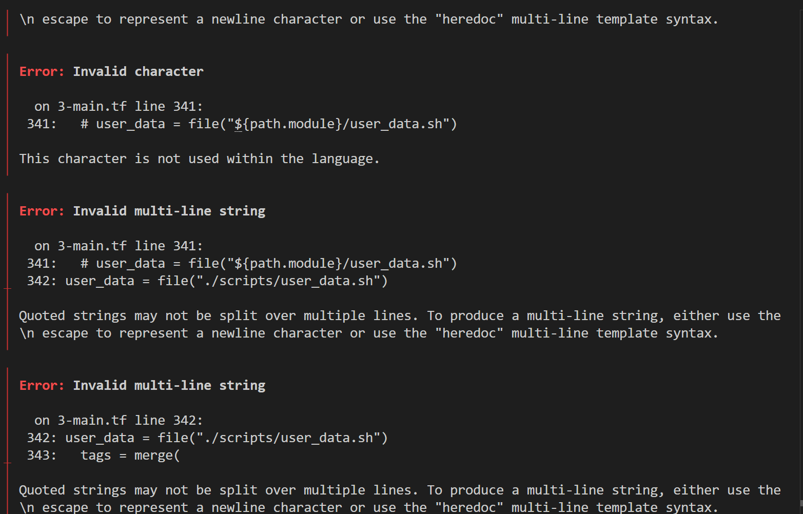
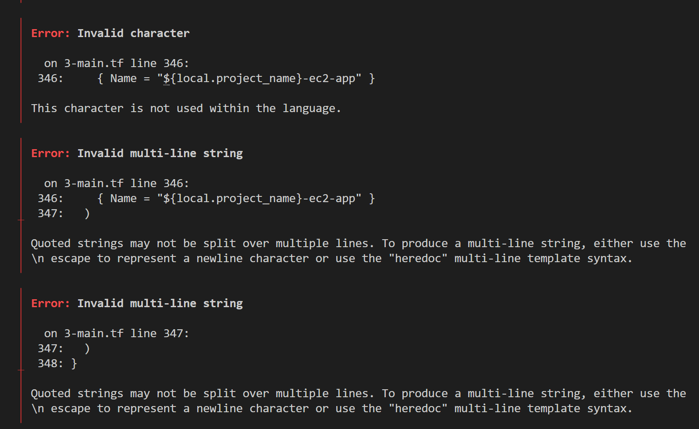

# AWS-Enterprise-App-Platform


# Mission Objective

This project stands up a private, production-shaped AWS environment entirely from code — a 3-AZ VPC, an EC2 app host, and a private MySQL RDS instance wired together through IAM and Secrets Manager (no hardcoded credentials), with CloudWatch alarms and an SNS incident alert so a real DB outage pages someone instead of failing silently. 

# Checkpoints

1. [Prerequisites](#prerequisites)
2. [Step-1: VPC and Networking](#step-1-vpc-and-networking)
3. [Step-2: IAM, Secrets Manager and Security Groups](#step-2-iam-secrets-manager-and-security-groups)
4. [Step-3: RDS, Parameter Store and EC2 App Host](#step-3-rds-parameter-store-and-ec2-app-host)
5. [Step-4: Observability, CloudWatch and SNS](#step-4-observability-cloudwatch-and-sns)
6. [Step-5: Terraform Validate, Plan and Apply](#step-5-terraform-validate-plan-and-apply)
7. [Errors](#errors)
8. [Deliverables](#deliverables)

# Prerequisites

* [Terraform](https://developer.hashicorp.com/terraform/install) `>= 1.5.0`
* [AWS CLI](https://docs.aws.amazon.com/cli/latest/userguide/getting-started-install.html) configured with credentials that can create VPC/EC2/RDS/IAM/CloudWatch/SNS resources:

  ```bash
  aws configure
  aws sts get-caller-identity   # sanity check — confirms your identity/account
  ```

* An EC2 key pair in your target region (default region here is `eu-west-2`), matching `var.aws_key_pair_name`:

  ```bash
  aws ec2 create-key-pair --key-name ec2-lab-app --region eu-west-2 \
    --query "KeyMaterial" --output text > ec2-lab-app.pem
  chmod 400 ec2-lab-app.pem
  ```

* Basic understanding of AWS networking (VPC/subnets/routing) and IAM roles
* Patience & lots of coffee

# Step-1: VPC and Networking

Terraform builds a `10.237.0.0/16` VPC with 3 public and 3 private subnets spread across three availability zones (`3-main.tf`), an Internet Gateway for the public side, and a NAT Gateway so the private subnets (where RDS lives) can reach out without being reachable from the internet. Public and private route tables are attached per-subnet with `count = length(...)` so the AZ count stays in sync automatically.

```bash
terraform init
terraform fmt
```



# Step-2: IAM, Secrets Manager and Security Groups

The EC2 instance assumes an IAM role (no static AWS keys on the box) that is scoped to exactly what the app needs:

* Read-only access to its own Secrets Manager secret (DB credentials)
* Read access to `/lab/db/*` in Parameter Store
* Permission to ship logs to its own CloudWatch log group
* `AmazonSSMManagedInstanceCore`, so you can shell in via Session Manager instead of SSH

Two security groups enforce network-level isolation: the EC2 SG allows inbound HTTP (80) from anywhere and SSH (22) only from your current public IP; the RDS SG only accepts MySQL (3306) traffic that originates from the EC2 SG — the database is never exposed to the internet or to any other instance.

# Step-3: RDS, Parameter Store and EC2 App Host

A private, single-AZ `db.t3.micro` MySQL 8.4 instance is created inside the private subnets via a DB subnet group. Its generated password (`random_password`) and connection details are written to Secrets Manager as a single JSON secret, and the endpoint/port/db-name are mirrored into SSM Parameter Store for quick lookup. The EC2 app host boots from the latest Amazon Linux 2 AMI (via SSM parameter lookup) and runs `scripts/user_data.sh` on first boot, which:

* Installs Python/Flask/PyMySQL/boto3 into a dedicated virtualenv under a non-root `rdsapp` service user
* Writes a small Flask app (`/init`, `/add?note=...`, `/list`) that reads its DB credentials from Secrets Manager at runtime
* Registers `rdsapp` as a systemd service so the app survives reboots

```bash
terraform apply -auto-approve
```



# Step-4: Observability, CloudWatch and SNS

A CloudWatch log group (`/aws/ec2/lab1c-rds-app`) collects the app's logs, and a metric filter watches for connection-failure patterns (`Can't connect`, `Access denied`, etc.). A CloudWatch alarm fires when 3+ matches land within a 5-minute window, which publishes to an SNS topic with an email subscription — so a real outage shows up in an inbox, not just a log file nobody's watching.

# Step-5: Terraform Validate, Plan and Apply

Standard IaC workflow — format, validate, plan, then apply:

```bash
terraform fmt
terraform validate
terraform plan
terraform apply
```





# Errors

Terraform is unforgiving about stray characters inside its HCL blocks. A misplaced inline comment next to the `user_data` and `tags` arguments in `3-main.tf` broke the parser with cascading `Invalid character` / `Invalid multi-line string` errors:




**Fix:** move stray comments onto their own line (or drop them) and keep argument assignments on a single line — HCL does not allow a quoted string to be split across lines outside of heredoc (`<<EOT`) syntax. After the fix, `terraform validate` returns `Success! The configuration is valid.` (see [Step-5](#step-5-terraform-validate-plan-and-apply)).

# Deliverables

* `terraform plan` output — see [terraform-plan-output.png](Images/terraform-plan-output.png)
* `terraform apply` evidence (resource creation + outputs) — see [terraform-apply-rds-creating.png](Images/terraform-apply-rds-creating.png)
* CLI verification commands confirming the EC2 instance can reach RDS and read its Secrets Manager credentials (see `scripts/gate_secrets_and_role.sh` and `scripts/gate_network_db.sh`)
* Incident runbook execution notes — alarm fired (simulated DB failure) and recovered via the SNS email alert
* Screen recordings of the full apply → verify → teardown cycle:
  * [▶ Demo clip 1](Images/terraform-demo-clip-1.mp4)
  * [▶ Demo clip 2](Images/terraform-demo-clip-2.mp4)
  * [▶ Full walkthrough recording](Images/screen-recording-2026-02-09.mp4)

# Final Step: Teardown

Unless you can print your own money, tear the deployment down when you're done:

* Run `terraform destroy` and confirm with `yes` when prompted
* Double-check the AWS console (VPC, EC2, RDS, CloudWatch, SNS) that every resource is actually gone
* Triple-check — RDS and NAT Gateways bill by the hour even when idle

```bash
terraform destroy
```

# Author

Benjamin Cooper
